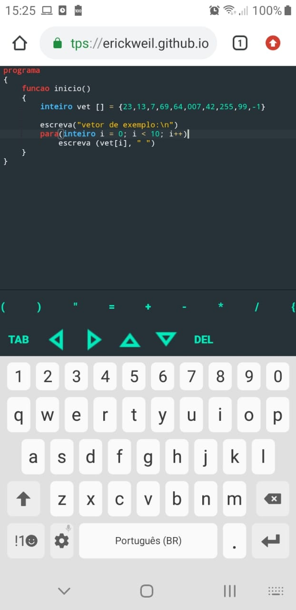

# Portugol Mobile
Simples versão web, compatível com smartphones, para programar na linguagem do portugol studio.



## Utilização

acesse: <a>https://erickweil.github.io/portugolweb/</a> para utilizar direto do navegador
ou baixe o aplicativo Android:<a>https://play.google.com/store/apps/details?id=br.erickweil.portugolweb</a> que permite utilizar offline.

Pode também baixar o inteiro projeto e abrir o arquivo index.html para utilizar offline. (Veja a seção instalação abaixo)

** obs: Ao utilizar no celular, haverá uma barra especial com caracteres para complementar o teclado **

## Recursos

Este projeto é uma implementação em javascript da linguagem Portugol, utilizada pelo programa Portugol Studio.
segue uma lista de funcionalidades que são suportadas

- Funções da linguagem
	- escreva
	- leia
	- limpa
	- sorteia
- Variáveis
	- todos os tipos ( inteiro, real, cadeia, caracter, logico )
- Vetores e Matrizes
	- permite vetores (1 dimensão) ou matrizes (2 dimensões)
- Estrutura Se-Senão
- Estrutura Enquanto
- Estrutura Faça-Enquanto
- Estrutura Escolha-caso

- Funções
	- funções com mesmo nome e assinaturas diferentes ( overloading )
	- Passagem de parâmetros por referência, por declarar o parâmetro com o símbolo &
	- vetores são sempre passados por referência

- Bibliotecas
	- Calendario
	- Graficos
		- Não funciona todos os métodos, principalmente os que trabalham com arquivos e/ou modificam imagens
		- imagens devem ser carregadas utilizando um url, e não um caminho de arquivo
    - Internet ( Só funciona no celular, dentro do aplicativo, pois chama realiza a requisição pelo app Android )
	- Matematica
	- Mouse ( No celular, um toque é BOTAO_ESQUERDO, dois toques é BOTAO_DIREITO e três toques é BOTAO_MEIO )
	- Objetos
	- Teclado ( No celular, ao usar a biblioteca Teclado aparecerá botões em baixo do canvas do modo gráfico para apertar )
	- Texto
	- Tipos
	- Util

- Execução passo-a-passo:
  	Ao clicar no botão que são dois Pés ao lado do executar, cada clique consecutivo executa apenas 1 linha de código.
	
Testes Apenas:
- Modo Turbo: Se marcado a caixa de modo turbo seu programa será compilado para javascript e terá chances de
executar mais rápido. Não funciona em funções que chamar o leia, Util.aguarde(), Graficos.renderizar() ou qualquer outra
função que 'pausa' o código
- Avaliador Automático ( acesse https://erickweil.github.io/portugolweb/avaliar.html )
	
### O que falta
	
- Mensagens de erros que definem melhor o que aconteceu e como corrigir
- Adicionar suporte às bibliotecas Sons, Arquivos, ServiçosWeb.
	- só que essas bibliotecas só vão funcionar no celular, pois javascript puro não permite acessar arquivos nem a internet
- Sistema de Inspeção de Variáveis em tempo de execução
- Permitir executar inserir pontos de depuração
- Hierarquia do código na lateral
- Mais exemplos de código
- Sistema de Ajuda
- Permitir compartilhar o código usando um link compartilhável
- Adaptar para que possa incluir o editor em um iframe em sites externos ( Moodle )
- Exportar código para outras linguagens

Aceito ajuda! 
  inicie uma discussão com uma nova Issue ou mande email para erickweil2@gmail.com com a sua sugestão ou problema que encontrou.

### Como funciona

Quando você clica em "Executar", todo o código que estiver no editor será compilado e executado, passando por etapas que lembram um pouco como Java funciona

1. Tokenizer: 
	Esta é a análise léxica, onde o código é dividido em 'tokens', isto é, partes elementares como palavras, números, símbolos, etc... 
2. Parser:
	Esta é a análise sintática, Os tokens são estruturados em uma árvore sintática. esta árvore contém todos os elementos do código organizados de forma que o compilador possa atravessar corretamente e gerar o código
3. Compiler:
	A árvore sintática é atravessada pelo compilador, e são gerados instruções chamadas de 'bytecode', semelhantes porém não iguais ao bytecode do Java.
4. Virtual Machine:
	Uma vez que o bytecode está gerado, a máquina virtual é iniciada e executa cada instrução uma após a outra.
	
Devido ao código ser executado em uma máquina virtual, o mesmo código executado aqui e no programa Portugol Studio, pode ser de 10 a 100 vezes mais lento ( se você usar para aprender a programar isso não será um problema )
Experimental: Clique no 'modo turbo' e em vez de ir para máquina virtual seu código é compilado para Javascript.

  
## Bibliotecas e Frameworks

* [Ace editor](https://github.com/ajaxorg/ace) - O editor do código.

Ferramentas apenas importantes durante o desenvolvimento:
* [NodeJS](https://nodejs.org/en/) - Para permitir todos esses módulos e plugins abaixo. (O site em si não roda em node).
* [WebPack](https://webpack.js.org/) + [Babel](https://babeljs.io/)- Para tornar o site mais leve, combinar os arquivos em um e escrever javascript moderno enquanto ainda tem suporte a mais navegadores
* [Jest](https://jestjs.io/) - Para testar o código durante o processo de desenvolvimento
* [ESLint](https://eslint.org/docs/latest/integrate/nodejs-api) - Para encontrar erros antes de executar o código javascript(Quase como em linguagens compiladas), e garantir certos estilos de escrita do código
* [Docker](https://www.docker.com/) - Para durante o desenvolvimento executar o site
## Instalação

É uma página web estática, não é preciso instalar:

> acesse: <a>https://erickweil.github.io/portugolweb/</a> para utilizar direto do navegador
> ou baixe o aplicativo Android:<a>https://play.google.com/store/apps/details?id=br.erickweil.portugolweb</a> que permite utilizar offline.

### Docker Aplicação Web

É possível executar uma imagem Docker baseada no nginx para hospedar o site em um container Docker.
Com o docker instalado basta executar:
```
docker run -d -p 80:80 erickweil/portugolweb
```

em seguida acesse http://localhost/

### Docker via terminal

Também é possível executar via terminal interativo, sem abrir a aplicação gráfica
Considerando que existe um diretório 'exemplos' com um arquivo 'entrada.por', 
o comando abaixo cria um container e executa este arquivo
```
docker run -it --rm erickweil/portugolweb:terminal -v ./:/app/exemplos --programa ./exemplos/entrada.por
```

### Executar Aplicação Web

Pode também baixar o inteiro projeto e abrir o arquivo index.html para utilizar offline no Computador ( É necessário ter um navegador web ). Não funcionará clicar nos exemplos a não ser que hospede em um servidor web estático local, como por exemplo apache ou nginx (Uma forma fácil seria instalar o XAMPP).

### Executar via terminal

Pode ser que você queira apenas a possibilidade de executar programas portugol .por, sem utilizar o editor web. É possível!

Para executar programas escritos em portugol via terminal basta clonar o repositório, ter nodejs instalado e executar:
```
npm install
node terminal.js --programa ./exemplos/entrada.por
```

Mude a opção --programa para o caminho do arquivo .por que deseja executar
Veja a ajuda com --ajuda para mais detalhes

## Licença 

GPL-3.0 - Veja o arquivo da licença: [Licença](LICENSE)

## Agradecimentos

* Este projeto foi inspirado pelo Projeto [Portugol Studio](https://github.com/UNIVALI-LITE/Portugol-Studio), e tem como objetivo trazer a programação nesta linguagem Portugol até os dispositivos móveis.